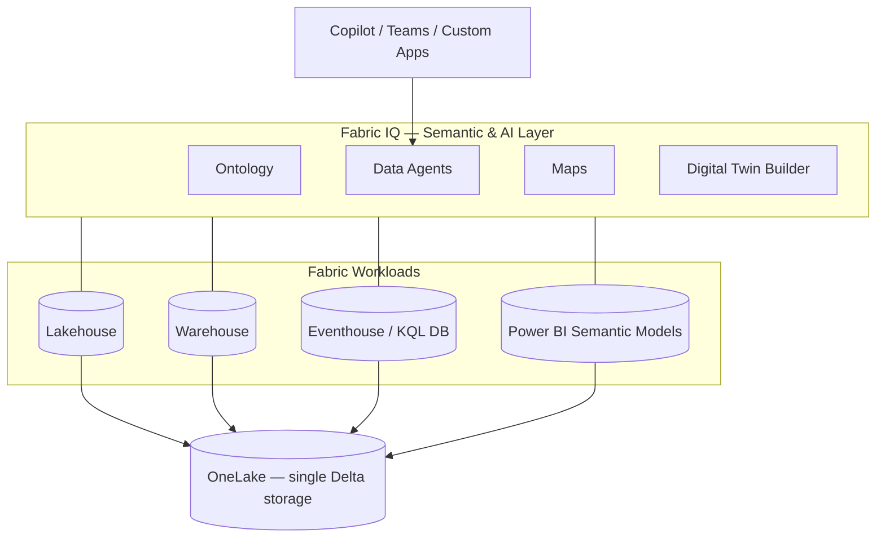

# 01 — What is Microsoft Fabric

Microsoft Fabric is a **unified, SaaS analytics platform** that brings together every workload a modern data team needs — data ingestion, engineering, warehousing, real-time intelligence, data science, BI, and operational databases — on top of a single, open, governed lake called **OneLake**.

## Why Fabric exists

Before Fabric, a typical analytics stack was a stitched-together collection of services (storage + ELT + DW + lakehouse + streaming + BI + ML), each with its own:

- Storage format and copy of data
- Compute engine and security model
- Billing meter and capacity sizing
- Governance and lineage story

Fabric collapses this into **one SaaS service, one storage layer, one capacity, one governance plane**.

## The five pillars of Fabric

| Pillar | What it is |
|---|---|
| **OneLake** | Single tenant-wide data lake built on ADLS Gen2, open Delta-Parquet format, with shortcuts so data is never copied twice |
| **One copy** | Workloads (DW, Lakehouse, KQL DB, Power BI) read/write the same Delta tables — no duplication |
| **One capacity** | A single SKU (F2 → F2048) powers every workload; pay-as-you-go or reserved |
| **One security model** | Workspace roles + item-level + OneLake RBAC + sensitivity labels |
| **One governance plane** | Microsoft Purview integration, lineage, data quality, certification |

## Workloads (a.k.a. experiences)

| Workload | Purpose | Storage / Engine |
|---|---|---|
| **Data Engineering** | Spark notebooks, Lakehouse, pipelines | Lakehouse (Delta) on OneLake |
| **Data Warehouse** | T-SQL DW with full DML | Warehouse (Delta) on OneLake |
| **Real-Time Intelligence** | Eventstream, **Eventhouse / KQL DB**, Activator | KQL DB on OneLake |
| **Data Science** | Notebooks, MLflow, AutoML | Lakehouse |
| **Data Factory** | Pipelines & dataflows gen2 | — |
| **Power BI** | Semantic models, reports, Direct Lake | Direct Lake on OneLake |
| **Databases** | Operational SQL DB (mirrored to OneLake) | SQL DB |
| **Fabric IQ** | Semantic / AI layer: Ontology, Data Agents, Maps, Digital Twin Builder | Sits **on top of** all the above |

## Where Fabric IQ fits

Fabric IQ does **not** store data of its own. It **describes** the data already in OneLake (via the Ontology) and **acts on it** (via Data Agents, Maps, Digital Twin Builder).

## Key takeaways before going to Fabric IQ

1. Everything you ground Fabric IQ on lives in **OneLake** as Delta.
2. **Lakehouse** = batch / curated tables. **Eventhouse** = high-throughput, low-latency streaming.
3. Both will appear in our labs — Lakehouse for static banking data, Eventhouse for card & deposit transactions.

## Further reading

- [Microsoft Fabric overview](https://learn.microsoft.com/en-us/fabric/fundamentals/microsoft-fabric-overview)
- [OneLake architecture](https://learn.microsoft.com/en-us/fabric/onelake/onelake-overview)
- [Fabric capacity & licensing](https://learn.microsoft.com/en-us/fabric/enterprise/licenses)
