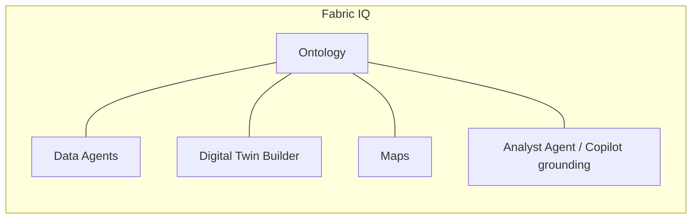

# 02 — What is Fabric IQ

**Fabric IQ** is the **semantic and AI layer of Microsoft Fabric**. It lets you describe your data the way the **business** thinks about it — in customers, products, transactions, branches — and then lets **AI agents and Copilot** reason on that description instead of raw tables.

> Reference: <https://learn.microsoft.com/en-us/fabric/iq/>

## The problem Fabric IQ solves

Lakehouses, warehouses, and KQL databases store **physical** data — tables, columns, partitions. But business questions like:

> "Show me Mass-Affluent customers in Bangkok with rising deposit balances and no credit card."

require **semantic** knowledge: who is a *customer*, what makes them *Mass-Affluent*, what *deposit balance* means, what *no credit card* implies in terms of joins. Without that semantic layer, every BI developer, every data scientist, and every AI agent has to reinvent it.

Fabric IQ centralizes that semantic knowledge so it can be reused by humans, BI, and AI.

## Components of Fabric IQ

### 1. Ontology
A business-friendly model of your domain expressed as **Business Domains → Entities → Properties → Relationships**, bound to the physical tables in OneLake. This is the foundation — every other Fabric IQ component consumes it. Covered in depth in [doc 03](03-ontology-concepts.md) and Labs 1–2.

### 2. Data Agents
Conversational AI agents grounded on **one or more ontologies**. They translate natural-language questions into governed queries against the underlying data and return contextual answers (text, tables, charts). They can be:
- Used in the Fabric portal
- Published to **Microsoft Teams**
- Called from **Microsoft 365 Copilot Studio** as a connected agent
- Embedded into custom apps via API

Covered in Lab 3.

### 3. Maps
Geo-aware semantic layer that lets entities with location properties be visualized and queried spatially (e.g., "show branches and customers within 5 km of a transaction").

### 4. Digital Twin Builder
Lets you compose and simulate **operational digital twins** of physical/business entities (e.g., a branch network, an ATM fleet, a payment-rails graph). Twins are powered by ontology + real-time streams from Eventhouse.

### 5. Analyst Agent / Copilot grounding
Generic Copilot experiences inside Fabric (notebooks, pipelines, Power BI) become *ontology-aware* once an ontology is published — grounding their suggestions in business terms instead of raw schema.

## How the components fit together

| Component | Reads from | Powered by | Surfaces in |
|---|---|---|---|
| **Ontology** | Lakehouse / Warehouse / Eventhouse / Semantic Models | OneLake metadata + IQ semantic engine | Other IQ components, Copilot |
| **Data Agent** | Ontology(ies) | Azure OpenAI under the hood | Fabric portal, Teams, M365 Copilot, REST |
| **Maps** | Ontology entities with geo properties | Azure Maps | Fabric reports, agents |
| **Digital Twin Builder** | Ontology + Eventhouse streams | Twin runtime | Operations agents, dashboards |

## When to use what

| If you need… | Use… |
|---|---|
| Stable business definitions for the whole org | **Ontology** |
| A chatbot that answers data questions in Teams | **Data Agent** + Ontology |
| Spatial intelligence on entities | **Maps** + Ontology |
| Live operational simulation / what-if | **Digital Twin Builder** + Ontology + Eventhouse |
| Copilot to "speak business" inside Fabric | Just publish the **Ontology** |

## Prerequisites for using Fabric IQ

- Fabric capacity with Fabric IQ enabled (F-SKU; trial works)
- Workspace assigned to that capacity
- Source data already in OneLake (Lakehouse / Warehouse / Eventhouse / Semantic Model)
- Permissions to create *Ontology* and *Data Agent* items in the workspace

## What we'll build in this repo

| Lab | Component focus |
|---|---|
| Lab 1 | **Ontology** — single domain, manual creation, table binding, intra-domain relationships |
| Lab 2 | **Ontology** — second domain + **cross-domain relationships** |
| Lab 3 | **Data Agent** grounded on the ontologies, published to **Teams** + (optional) **M365 Copilot Studio** for lead qualification |
| Lab 4 | **Operations Agent** (built on Digital Twin Builder + streaming Eventhouse data) — _to be added_ |

## Further reading

- [Fabric IQ documentation](https://learn.microsoft.com/en-us/fabric/iq/)
- [Ontology in Fabric IQ](https://learn.microsoft.com/en-us/fabric/iq/ontology-overview)
- [Data Agents in Fabric](https://learn.microsoft.com/en-us/fabric/iq/data-agent-overview)
