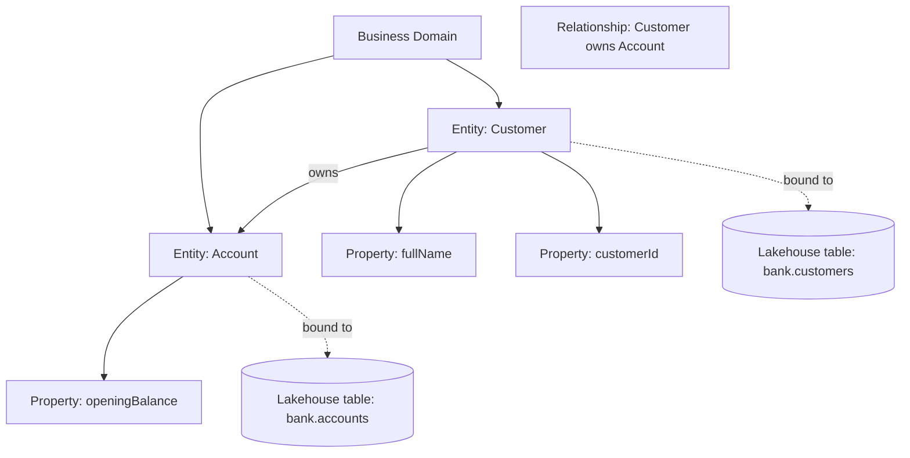
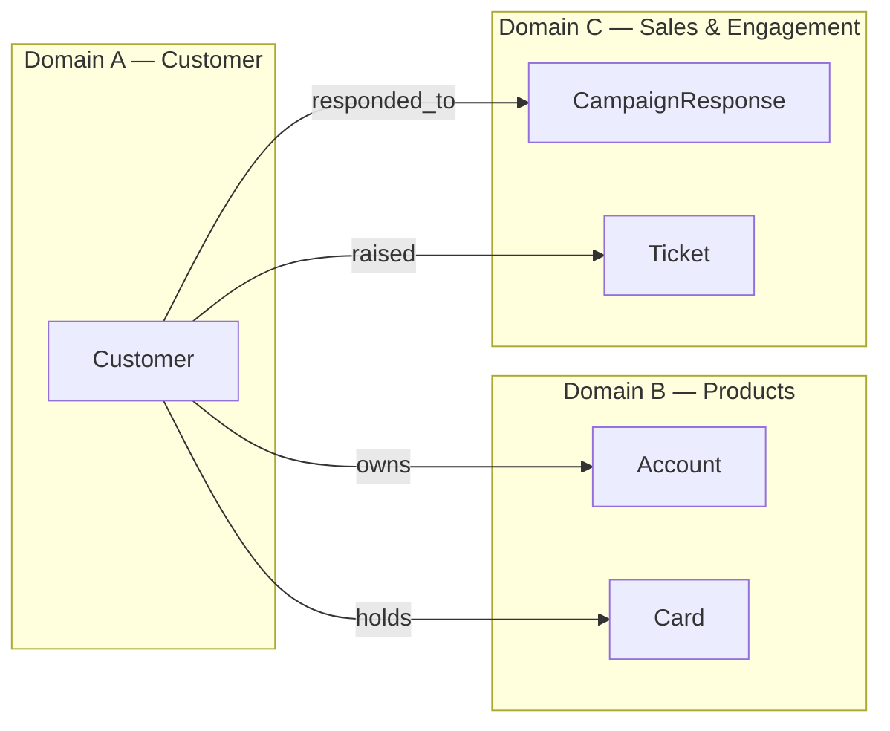

# 03 — Ontology: General Theory & in Fabric IQ

## 1. What is an Ontology in general?

In information science, an **ontology** is a *formal, explicit specification of a shared conceptualization*. In plain language: **a written-down agreement about what things exist in a business domain, what properties they have, and how they relate to each other** — independent of any specific database.

A minimal ontology has four building blocks:

| Concept | Meaning | Banking example |
|---|---|---|
| **Class / Entity** | A category of things | `Customer`, `Account`, `Card` |
| **Property / Attribute** | A characteristic of an entity | `Customer.fullName`, `Account.balance` |
| **Relationship** | A typed link between entities | `Customer owns Account` |
| **Constraint / Rule** | Logical rules over the above | "An Account must have exactly one primary Customer" |

### Ontology vs. data model vs. schema

| Aspect | Schema (DB) | Logical data model | **Ontology** |
|---|---|---|---|
| Focus | Physical storage | Logical structure | **Meaning** |
| Audience | DBA / engineer | Data architect | **Business + data + AI** |
| Reuses across systems? | No | Sometimes | **Yes — that's the point** |
| Supports inference? | No | No | **Yes** |
| Bound to one technology? | Yes | Usually | **No** |

Two products may have very different schemas but share the same ontology — that's why ontologies are durable while schemas churn.

### Why ontologies matter for AI

Modern LLM-based agents are great at language but terrible at guessing what a column means. When you ground an agent on an ontology:
- It understands **business terms** (`Mass-Affluent`, `delinquent loan`, `dormant account`)
- It uses **the same joins your analysts use**
- It respects **semantic constraints** (a card belongs to one customer; a transaction is denominated in THB)
- Its answers stay **consistent** across teams, reports, and chatbots

## 2. What is an Ontology in Fabric IQ?

In Fabric IQ, an **Ontology** is a first-class workspace item that captures the four building blocks above and **binds them to physical tables in OneLake** (Lakehouse, Warehouse, Eventhouse, Semantic Model). The Fabric IQ vocabulary maps directly to the general theory:

| General term | Fabric IQ term |
|---|---|
| Domain / context | **Business Domain** |
| Class / Entity | **Entity** |
| Property | **Property** |
| Relationship | **Relationship** (intra- or cross-domain) |
| Bound source | **Data binding** to a table/view |
| Business glossary term | **Description / business term** on entity or property |

### The Fabric IQ ontology hierarchy

### Cross-ontology relationships

Real businesses have **multiple domains** (Customer, Products, Sales & Engagement, Risk, Operations…). Fabric IQ lets you draw relationships **across ontologies** so an agent can traverse from a campaign response (Sales) to a customer (Customer) to an account (Products) — all without anyone hand-coding joins.

Lab 1 builds Domain A. Lab 2 adds Domains B & C and the cross-domain edges.

## 3. Why Ontology matters in Fabric IQ — five concrete reasons

1. **Business language for everyone.** Analysts, agents, and Copilot all speak the same vocabulary.
2. **Reuse over rewrite.** One ontology powers many Data Agents, dashboards, twins, and Copilot experiences.
3. **AI grounding that survives schema change.** Re-bind a property when a table changes; every agent keeps working.
4. **Cross-domain reasoning without ad-hoc joins.** Cross-ontology relationships make traversal automatic.
5. **Governance you can audit.** Descriptions, sensitivity labels, and lineage all live with the entity.

## 4. Authoring patterns

| Pattern | When to use |
|---|---|
| **Top-down** (start with business glossary, then bind data) | Greenfield, when business has a clear taxonomy |
| **Bottom-up** (start from existing tables, lift entities) | Brownfield, fast wins on existing Lakehouses |
| **Hybrid** (top-down skeleton, bottom-up details) | Most real projects — and what we'll do in Lab 1 |

## 5. Anti-patterns to avoid

- ❌ One giant ontology with hundreds of entities — split into Business Domains.
- ❌ Property names that mirror physical column names (`cust_id_fk`) — use business names (`customerId`).
- ❌ No descriptions on entities/properties — agents won't disambiguate without them.
- ❌ Hard-coding joins in reports while the ontology has no relationship — inconsistency guaranteed.
- ❌ Binding to raw bronze tables — bind to curated silver/gold so quality is predictable.

## Further reading

- [Ontology overview (Microsoft Learn)](https://learn.microsoft.com/en-us/fabric/iq/ontology-overview)
- [Create and manage an ontology](https://learn.microsoft.com/en-us/fabric/iq/create-ontology)
- [Bind ontology entities to data](https://learn.microsoft.com/en-us/fabric/iq/bind-data)
