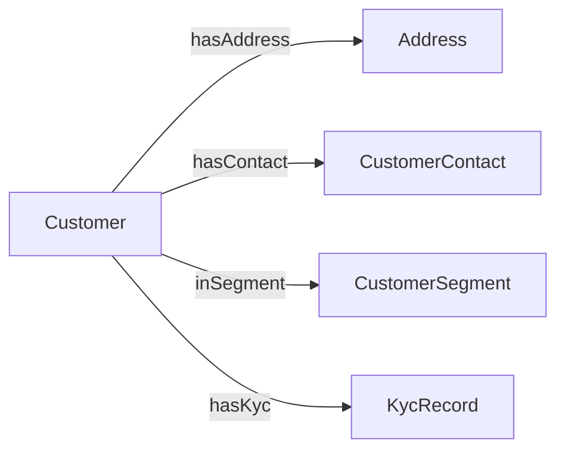

# Lab 1 — Build a Fabric IQ Ontology from scratch

> **Domain focus:** Domain A — Customer
> **Estimated time:** 60–75 minutes
> **Level:** 300

In this lab you will build your first **Fabric IQ Ontology**, end to end, against the Thai retail-banking dataset. By the end you'll have:

- A Lakehouse populated with Domain A tables (Customer, Address, Segment, KYC, Contact)
- A new **Ontology** item in your workspace
- A **Customer Business Domain** with **5 entities**, **typed properties**, and **business descriptions**
- **Data bindings** from each entity to its Lakehouse table
- **Intra-domain relationships** (e.g., `Customer hasAddress Address`)
- A working preview that shows entity rows pulled live from the Lakehouse

## Why this lab matters

Most failed AI/data projects fail because there is no shared business semantics. Lab 1 walks you through the **smallest meaningful ontology** so you internalize the *Domain → Entity → Property → Relationship → Binding* loop before you scale to multiple domains in Lab 2.

## Prerequisites

- ✅ Fabric workspace on a capacity with Fabric IQ enabled — see [workshop/prerequisites.md](../../workshop/prerequisites.md)
- ✅ Permission to create Lakehouse + Ontology in the workspace
- ✅ The mock CSVs from this repo at [`data/batch/`](../../data/batch/) — already generated and committed, so just clone the repo (no Python required for the lab itself).

## Steps

| # | Step | Outcome |
|---|---|---|
| 1 | [Set up the Lakehouse and load Domain A data](step-01-setup-lakehouse.md) | Lakehouse `BankingIQ_LH` with 6 Customer-domain tables |
| 2 | [Create the Ontology and the Customer Business Domain](step-02-create-ontology.md) | Empty `BankingIQ_Customer` ontology |
| 3 | [Define entities and properties](step-03-define-entities-properties.md) | 5 entities with typed business properties |
| 4 | [Bind entities to Lakehouse tables](step-04-bind-to-lakehouse.md) | Live data preview on each entity |
| 5 | [Create intra-domain relationships](step-05-create-relationships.md) | Customer↔Address, Customer↔Segment, Customer↔KYC, Customer↔Contact |

## What you'll build (visual)

Each box becomes an **Entity**, each arrow becomes a **Relationship**. Underneath, every box is **bound** to a Delta table in your Lakehouse.

## Lab conventions

- All screenshots are referenced as `[screenshot: …]` placeholders. Replace with your own as you run.
- Names in the UI are exactly the names you should type — copy them to keep Labs 2 & 3 working.
- THB amounts and Thai names are intentional; do not localize away.

When you're done, continue to [Lab 2 — Cross-Ontology Relationships](../lab-02-cross-ontology-relationships/README.md).
