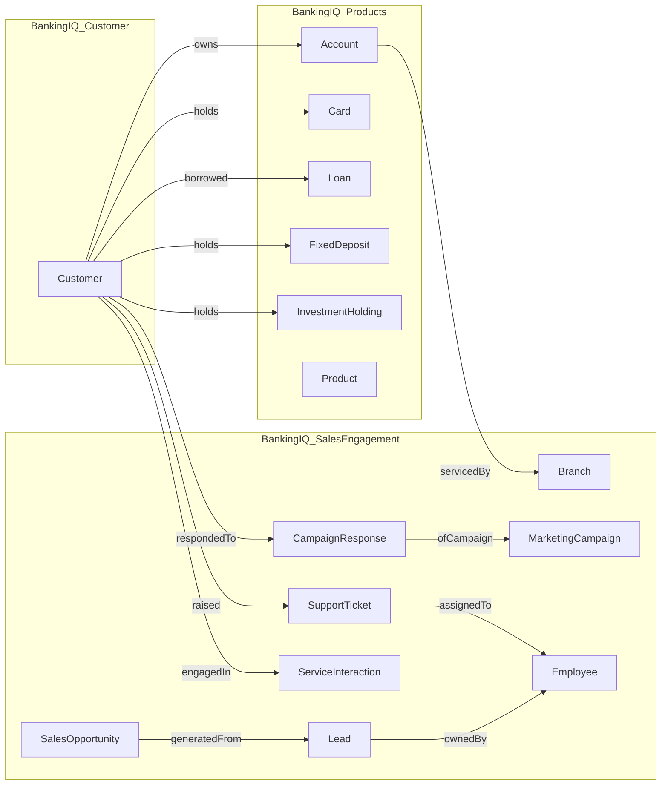

# Lab 2 — Cross-Ontology Relationships

> **Domain focus:** Domain B (Products) + Domain C (Sales & Engagement) + cross-ontology links to Domain A
> **Estimated time:** 75–90 minutes
> **Level:** 300–400
> **Prerequisite:** [Lab 1](../lab-01-ontology-from-scratch/README.md) completed and published.

In this lab you'll grow from a single-domain ontology to a **multi-domain semantic graph**. You'll create two new ontologies (Products, Sales & Engagement), bind them to the Lakehouse, and then connect all three using **cross-ontology relationships** so an agent can reason from a *campaign* all the way down to a *card transaction* without writing SQL.

## Why cross-ontology matters

In real banks, *Customer*, *Products*, and *Sales & Engagement* are owned by different teams. Each team should own its own ontology. Fabric IQ lets you keep that ownership boundary while still letting agents traverse across them — that's what cross-ontology relationships do.

## Steps

| # | Step | Outcome |
|---|---|---|
| 1 | [Build the Products ontology](step-01-build-products-ontology.md) | New `BankingIQ_Products` ontology with 7 entities |
| 2 | [Build the Sales & Engagement ontology](step-02-build-sales-engagement-ontology.md) | New `BankingIQ_SalesEngagement` ontology with 8 entities |
| 3 | [Connect ontologies with cross-domain relationships](step-03-cross-ontology-relationships.md) | Customer↔Products, Customer↔SalesEngagement, Branch/Employee↔Products |

## Final picture

Bold lines crossing the subgraph boundaries are **cross-ontology** relationships — that's the new thing in this lab.
